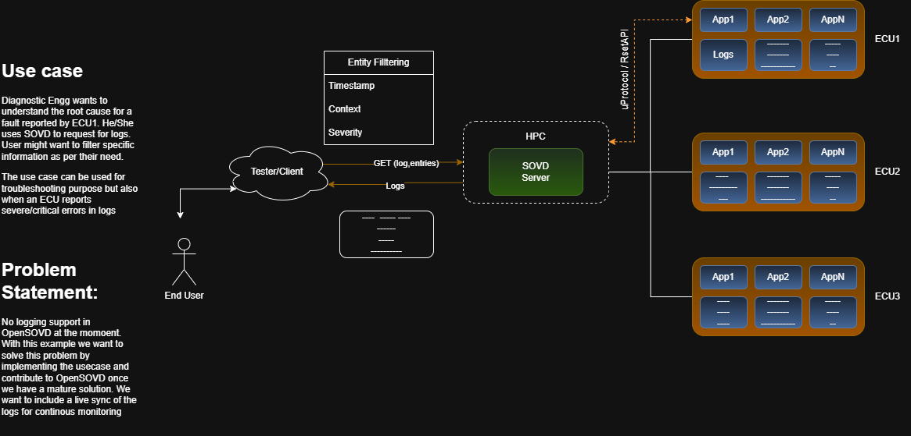

# TRAceON

> SOVD logs resource for OpenSOVD, fetched from the ECU over uProtocol/Zenoh.

TRAceON implements the SOVD `logs` resource for [OpenSOVD](https://github.com/eclipse-opensovd),
letting a diagnostics engineer pull filtered logs from vehicle ECUs through a single SOVD
interface to speed up root-cause analysis.



## Problem Statement

OpenSOVD does not yet provide a native logging resource. When an ECU reports a fault there is
no unified way to collect and inspect logs across the vehicle network.

TRAceON fills that gap end-to-end with two complementary ingestion paths, with the goal of
contributing the implementation back to OpenSOVD once it is mature.

## System Architecture

TRAceON supports two log ingestion paths that can be selected at runtime.

### Path 1 — ThreadX / MQTT hardware ingest (default mode)

A hardware ECU running **ThreadX RTOS** publishes log events over **MQTT**. An MQTT receptor
bridges those events into the SOVD server via a REST sink. The server buffers entries in memory
and broadcasts them to any active SSE stream.

```text
+------------------+   MQTT publish   +------------------+   POST /internal/logs
|  ECU (ThreadX)   | ---------------> |  MQTT Receptor   | --------------------->+
+------------------+                  +------------------+                        |
                                                                                   v
+------------+   GET /sovd/v1/apps/diag-app/logs/entries   +--------------------+
| Tester /   | <------------------------------------------ |  sovd_server_comp  |
| Client     |   GET /sovd/v1/apps/diag-app/logs/entries   |  DiagLogProvider   |
|  (UI/curl) |        /stream  (SSE live stream)           |  (in-memory ring   |
+------------+ ----------------------------------------->  |   + broadcast)     |
                                                            +--------------------+
```

### Path 2 — uProtocol / Zenoh RPC

A standalone ECU stand-in (`dummy_diag_app`) exposes a `getLogs` / `getConfig` RPC service
over **uProtocol** using a **Zenoh** TCP transport. The SOVD server connects to it and
delegates every `GET /entries` request to the ECU via RPC.

```text
+------------+   GET /sovd/v1/apps/diag-app/logs/entries   +--------------------+
| Tester /   | -----------------------------------------> |  sovd_server_comp  |
| Client     | <------------------------------------------ |  UProtocolLog-     |
+------------+           Filtered log entries              |  Provider          |
                                                            +--------------------+
                                                                     |
                                                         uProtocol getLogs RPC
                                                         UPAYLOAD_FORMAT_JSON
                                                         (Zenoh TCP transport)
                                                                     |
                                                          +--------------------+
                                                          |  dummy_diag_app    |
                                                          |  (ECU stand-in)    |
                                                          +--------------------+
```

See [docs/TraceON_UseCase.md](docs/TraceON_UseCase.md) for the full use-case description.

## Repository Structure

```text
TRAceON/
├── diagnostic_components/
│   ├── sovd_server_comp/             # SOVD server — REST API, log sink, SSE stream, UI
│   ├── uprotocol_log_client_comp/    # uProtocol RPC client library (getLogs/getConfig/…)
│   └── dummy_diag_app/               # Standalone ECU stand-in — serves getLogs over Zenoh
├── docs/
│   ├── TRAceON.png
│   └── TraceON_UseCase.md
└── open_source/
    └── opensovd-core/                # OpenSOVD core (git submodule)
```

## What Is Implemented

- **SOVD logs REST API** — `GET /entries`, `GET /config`, `PUT /config`, `DELETE /config`
  under `/sovd/v1/apps/{app-id}/logs/`.
- **Live SSE stream** — `GET /entries/stream` pushes new entries in real time via
  Server-Sent Events; backed by a `tokio::broadcast` channel fed by the hardware ingest sink.
- **Hardware log ingest sink** — `POST /internal/logs` accepts JSON log events from an
  MQTT receptor (ThreadX ECU → MQTT → receptor → REST sink → SOVD); entries are buffered
  in a ring buffer (max 1024) and immediately broadcast to active SSE subscribers.
- **Severity and time filters** — `?severity=`, `?created-after=`, `?created-before=`
  query parameters on `GET /entries`.
- **Per-context severity config** — `PUT /config` stores a threshold per context type
  (RFC 5424 or AUTOSAR DLT); `entries()` and `stream()` both apply it server-side.
- **uProtocol/Zenoh transport** — `getLogs`, `getConfig`, `configure`, `resetConfig` RPCs
  carried as `UPAYLOAD_FORMAT_JSON` over a Zenoh TCP peer connection.
- **Two-process uProtocol demo** — `sovd_server_comp` (HPC) + `dummy_diag_app` (ECU)
  run as separate OS processes connected by Zenoh.
- **Live log viewer UI** — served at `/ui/`; context-aware filtering, per-context severity
  config panel, auto-refresh, SSE live mode.

## Roadmap

- Context-type filter on `GET /entries` (`?context-type=`).
- Real DLT / journald log ingestion on the ECU side.
- Continuous ECU health monitoring and alerting.
- Multi-ECU topology (register one `App` per ECU in the SOVD topology).
- OpenDUT integration for fleet deployment and test orchestration.

## Getting Started

### Prerequisites

- [Rust toolchain](https://rustup.rs/)
- Git with submodule support

### Clone

```bash
git clone --recurse-submodules <repository-url>
cd TRAceON
```

If you already cloned without submodules:

```bash
git submodule update --init --recursive
```

### Build

```bash
# Build all three crates from the workspace root
cargo build
```

### Run — ThreadX/MQTT hardware ingest mode (default)

The server starts with an empty ring buffer and waits for hardware events on
`POST /internal/logs`. Seed entries are pre-loaded so the UI shows data immediately.

```bash
# Serves on 0.0.0.0:8080
# UI:    http://localhost:8080/ui/
# API:   http://localhost:8080/sovd/v1/apps/diag-app/logs/entries
# Sink:  POST http://localhost:8080/internal/logs
SOVD_STATIC_DIR=diagnostic_components/sovd_server_comp/static \
  cargo run -p sovd_server_comp
```

Send a hardware log event to the sink:

```bash
curl -X POST http://localhost:8080/internal/logs \
  -H 'Content-Type: application/json' \
  -d '{"timestamp":"2026-01-01T00:00:00Z","severity":"error","msg":"brake fault","context":{"type":"AUTOSAR_DLT","application_id":"BRK","context_id":"FAULT"}}'
```

### Run — uProtocol/Zenoh two-process mode

**Terminal 1 — ECU stand-in (listens on Zenoh TCP):**

```bash
APP_ZENOH_LISTEN=tcp/127.0.0.1:7447 cargo run -p dummy_diag_app
```

**Terminal 2 — SOVD server (connects to ECU over Zenoh):**

```bash
TRACEON_LOG_SOURCE=uprotocol \
APP_ZENOH_CONNECT=tcp/127.0.0.1:7447 \
SOVD_STATIC_DIR=diagnostic_components/sovd_server_comp/static \
  cargo run -p sovd_server_comp
```

### Environment Variables

| Variable | Component | Default | Description |
|---|---|---|---|
| `TRACEON_LOG_SOURCE` | `sovd_server_comp` | _(unset)_ | Set to `uprotocol` to fetch logs from the ECU over Zenoh; omit for ThreadX/MQTT REST sink mode |
| `APP_ZENOH_CONNECT` | `sovd_server_comp` | `tcp/127.0.0.1:7447` | Zenoh TCP endpoint of the ECU to connect to |
| `APP_ZENOH_LISTEN` | `dummy_diag_app` | `tcp/127.0.0.1:7447` | Zenoh TCP endpoint the ECU listens on |
| `SOVD_STATIC_DIR` | `sovd_server_comp` | `static` | Path to the directory containing `index.html` for the log viewer UI |
| `RUST_LOG` | both | `info` | Tracing log level (`trace`, `debug`, `info`, `warn`, `error`) |

### API Base Path

All SOVD endpoints are versioned under `/sovd/v1`:

```
GET    /sovd/v1/apps/diag-app/logs
GET    /sovd/v1/apps/diag-app/logs/entries[?severity=warn&created-after=<iso8601>]
GET    /sovd/v1/apps/diag-app/logs/entries/stream   (SSE live stream)
GET    /sovd/v1/apps/diag-app/logs/config
PUT    /sovd/v1/apps/diag-app/logs/config
DELETE /sovd/v1/apps/diag-app/logs/config

POST   /internal/logs   (hardware event ingest — ThreadX/MQTT receptor bridge)
```

The live log viewer UI is served at `http://localhost:8080/ui/`.

## Scripts

All scripts are in the `scripts/` directory. Make them executable once with `chmod +x scripts/*.sh`.

| Script | Description |
|---|---|
| `start-ui.sh` | Starts `sovd_server_comp` in a new terminal tab and automatically opens the log viewer UI in the browser |
| `stream-logs.sh [severity]` | Full live streaming pipeline — opens 3 terminal tabs: SOVD server, telemetry server (MQTT→forward), and live SSE stream |
| `terminal-1-sovd-server.sh` | Starts the SOVD server on port 8080 (UI on 8082) |
| `terminal-2-telemetry.sh` | Clones TRAceON-ThreadX (if needed), sets up Python venv, starts the telemetry server on port 8083 |
| `terminal-3-stream.sh [severity]` | Enables log forwarding and tails the live SSE stream |

**Quick start — UI only:**
```bash
./scripts/start-ui.sh
```

**Quick start — full live stream from ThreadX ECU:**
```bash
./scripts/stream-logs.sh DLT_ERROR
```

See [LIVE-STREAM-SETUP.md](LIVE-STREAM-SETUP.md) and [UI-GUIDE.md](UI-GUIDE.md) for detailed instructions.

## Contributing

This project is intended to be contributed back to OpenSOVD. Contributions are welcome —
please open an issue or pull request to discuss changes.

## License

Apache-2.0 — see [LICENSE](LICENSE).

## Team

| Name | Role |
|---|---|
| Helge Gudmundsen | Developer |
| Isabella Lanes Rocha | Developer |
| Kavyasree Sankaranarayanan Nair | Developer |
| Marufa Binte Mostafa | Developer |
| Matheus Abrahao | Developer |
| Priyankkumar Bidya | Developer |
| Himank Meattle | Team Support |
