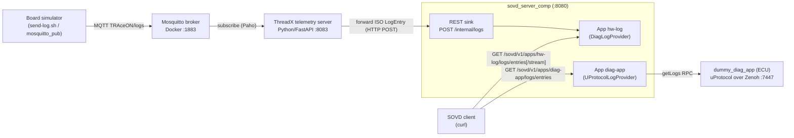
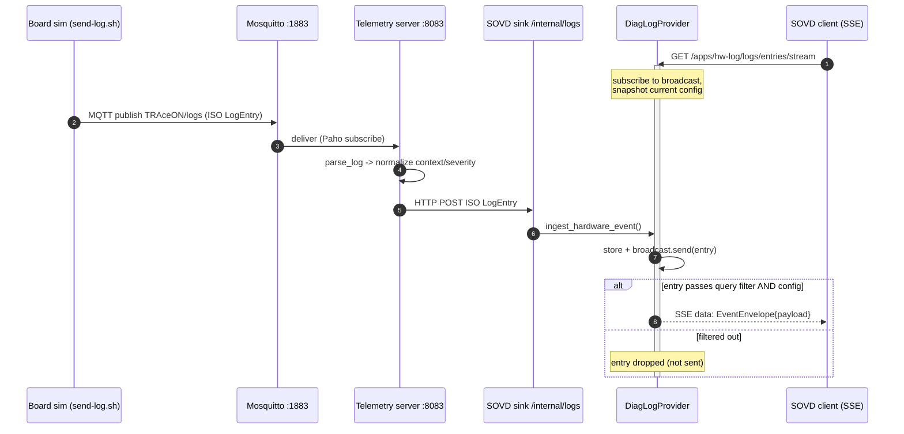
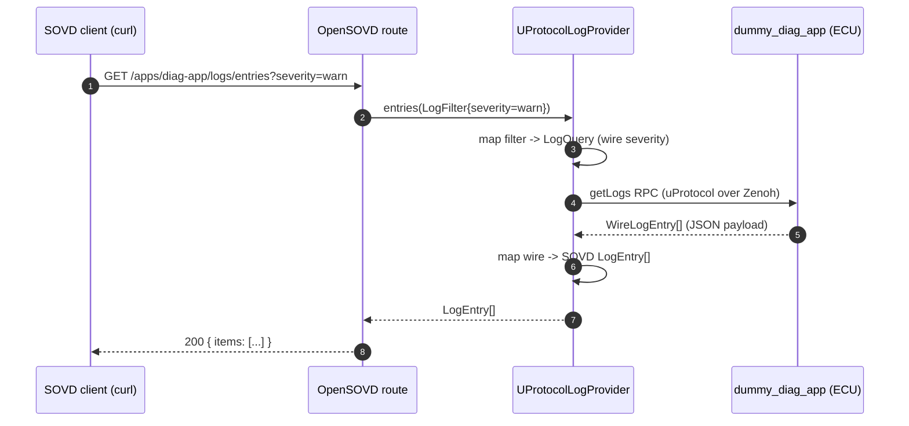
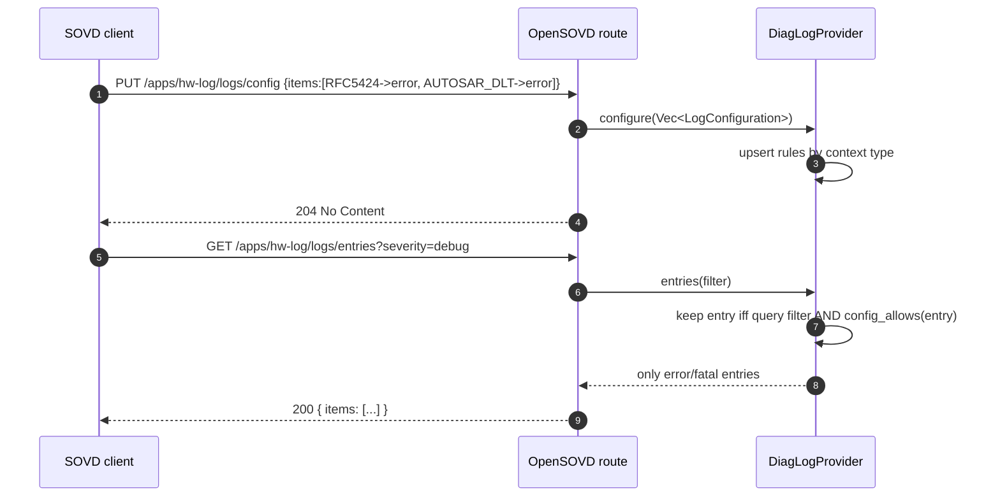
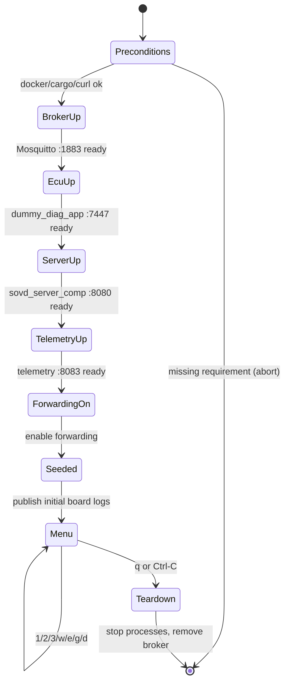
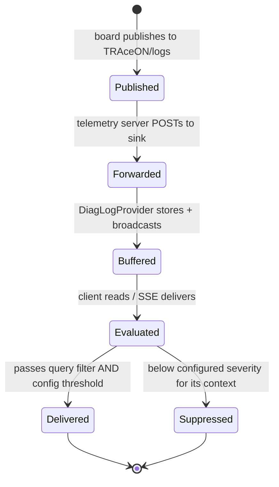

<!--
SPDX-FileCopyrightText: Copyright (c) 2026 Contributors to the Eclipse Foundation
SPDX-License-Identifier: Apache-2.0
-->

# TRAceON Demo — Architecture, Requirements & Deployment

This document describes the two TRAceON demonstrations: how to run them, what
they prove, the components involved, and the runtime behaviour (sequence and
state diagrams).

TRAceON implements the **SOVD `logs` resource** (ISO 17978-3:2026, §7.21) on top
of Eclipse OpenSOVD, and shows **two independent log sources served through one
SOVD server**:

- **`diag-app`** — logs fetched on demand from an ECU over **uProtocol / Zenoh**.
- **`hw-log`** — logs streamed from the **Eclipse ThreadX** telemetry pipeline
  (MQTT → telemetry server → forwarding), with a live Server-Sent Events (SSE)
  stream.

---

## 1. The two demos

| Script | What it shows | External dependencies | Interactivity |
|---|---|---|---|
| `scripts/demo.sh` | Smoke test: both apps behind one SOVD server, config round-trip, live SSE — fed by **synthetic** events posted straight to the sink. | Rust + curl only | Scripted (runs, prints, exits) |
| `scripts/demo-threadx.sh` | Full pipeline: `hw-log` fed by the **real Eclipse ThreadX** telemetry chain (MQTT broker → telemetry server → log forwarding). | Rust, curl, Docker, Python 3, `mosquitto_pub` | **Interactive menu** |

`demo.sh` is the lightweight fallback (no Docker/broker/Python needed).
`demo-threadx.sh` is the realistic end-to-end demo.

---

## 2. Requirements

### 2.1 Common (both demos)

- **Rust toolchain** (stable, edition 2021+). Install via rustup; then
  `source "$HOME/.cargo/env"`.
- A C compiler (`cc`/`gcc`) — required to build native dependencies (Zenoh).
- **curl**.
- The OpenSOVD fork checked out as the submodule at
  `open_source/opensovd-core` (pinned at the branch that provides the `logs`
  resource and DLT severities).

### 2.2 Additional for `demo-threadx.sh`

- **Docker** — runs the Eclipse Mosquitto broker (`eclipse-mosquitto:2`).
- **Python 3** — runs the ThreadX telemetry server (FastAPI/uvicorn/Paho). The
  demo creates the virtualenv automatically on first run
  (`TRAceON-ThreadX/telemetry-server/setup.sh`).
- **`mosquitto_pub`** — used by the ThreadX `send-log.sh` publisher to simulate
  the board. If it is not installed system-wide, a user-local install works and
  the demo also looks in `~/.local/bin`:

  ```bash
  # user-local install without root:
  cd /tmp && apt-get download mosquitto-clients libmosquitto1
  dpkg-deb -x mosquitto-clients_*.deb x && dpkg-deb -x libmosquitto1_*.deb x
  mkdir -p ~/.local/bin ~/.local/lib
  cp x/usr/bin/mosquitto_pub ~/.local/bin/ && cp -P x/usr/lib/*/libmosquitto.so* ~/.local/lib/
  # ensure the loader finds the lib (wrapper or LD_LIBRARY_PATH="$HOME/.local/lib")
  ```

### 2.3 Ports used

| Port | Owner | Purpose |
|---|---|---|
| `8080` | `sovd_server_comp` | SOVD HTTP API (`/sovd/v1/...`) + internal sink (`/internal/logs`) |
| `7447` | `dummy_diag_app` | Zenoh TCP listener (uProtocol transport) |
| `1883` | Mosquitto (Docker) | MQTT broker (ThreadX pipeline) |
| `8083` | telemetry-server | ThreadX telemetry HTTP API + forwarding control |

All services bind to loopback (`127.0.0.1`); no board or Wi-Fi is required.

---

## 3. Components

| Component | Path | Role |
|---|---|---|
| `sovd_server_comp` | `diagnostic_components/sovd_server_comp` | The SOVD server. Registers two apps and owns the REST sink (`/internal/logs`). |
| `DiagLogProvider` | `.../sovd_server_comp/src/log_provider.rs` | `hw-log` provider: in-memory ring buffer, SSE via `tokio::broadcast`, per-context config filter. |
| `UProtocolLogProvider` | `diagnostic_components/uprotocol_log_client_comp` | `diag-app` provider: forwards `getLogs`/config RPCs to the ECU over uProtocol. |
| `dummy_diag_app` | `diagnostic_components/dummy_diag_app` | ECU stand-in: a uProtocol RPC server over a Zenoh transport. |
| OpenSOVD fork | `open_source/opensovd-core` | Core types, models, and the HTTP routes for the `logs` resource (incl. the SSE extension). |
| Mosquitto | Docker `eclipse-mosquitto:2` | MQTT broker for the ThreadX pipeline. |
| Telemetry server | `TRAceON-ThreadX/telemetry-server` | Subscribes to the broker; forwards each ISO `LogEntry` to the SOVD sink. |
| Board simulator | `TRAceON-ThreadX/scripts/send-log.sh` | Publishes ISO `LogEntry` JSON to `TRAceON/logs` over MQTT. |

### 3.1 Architecture (full ThreadX demo)



Note: in `demo.sh` the `board → broker → telemetry server` chain is replaced by
`curl` POSTing synthetic events straight to the sink; everything to the right of
the sink is identical.

---

## 4. Deployment / running

### 4.1 Quick smoke test

```bash
source "$HOME/.cargo/env"
./scripts/demo.sh
```

Starts `dummy_diag_app` and `sovd_server_comp`, posts a few synthetic events,
reads both apps, exercises the config PUT/DELETE, tails the SSE once, then tears
everything down.

### 4.2 Full ThreadX demo (interactive)

```bash
source "$HOME/.cargo/env"
./scripts/demo-threadx.sh
```

Startup order (the script waits for each port before continuing):

1. Mosquitto broker (Docker) on `:1883`.
2. `dummy_diag_app` (ECU) Zenoh listener on `:7447`.
3. `sovd_server_comp` on `:8080`, registering **both** apps.
4. Telemetry server on `:8083`, with forwarding enabled toward
   `http://127.0.0.1:8080/internal/logs`.
5. `hw-log` is seeded with a few board logs so the first read is not empty.

Then an interactive menu is presented:

| Key | Action |
|---|---|
| `1` | Read `diag-app` entries (uProtocol source) |
| `2` | Read `hw-log` entries (ThreadX source) |
| `3` | Tail `hw-log` **live SSE** (~7s); publishes board logs one per second |
| `w` | PUT `hw-log` config, severity `warn` (both contexts) |
| `e` | PUT `hw-log` config, severity `error` (both contexts) |
| `g` | GET `hw-log` config |
| `d` | DELETE `hw-log` config (reset to default) |
| `q` | Quit — tears everything down |

**Config scope:** the `w`/`e`/`g`/`d` keys configure the **`hw-log` entity
only**. Per ISO 17978-3 §7.21, log configuration is per entity, so `diag-app`
keeps its own independent configuration and is not affected.

### 4.3 Teardown

Both scripts register a trap that, on exit (including `q` or Ctrl-C), stops the
started processes and — if the script started it — removes the broker container.
Ports are released and no orphan processes remain.

### 4.4 Relevant environment variables

| Variable | Default | Used by |
|---|---|---|
| `TRACEON_UPROTOCOL` | (on) | `sovd_server_comp`: set to `off` to skip the `diag-app`/uProtocol source |
| `APP_ZENOH_LISTEN` | `tcp/127.0.0.1:7447` | `dummy_diag_app` listen endpoint |
| `APP_ZENOH_CONNECT` | `tcp/127.0.0.1:7447` | `sovd_server_comp` → ECU connect endpoint |
| `TRACEON_MQTT_HOST` | `localhost` | telemetry server broker host |
| `TRACEON_HTTP_PORT` | `8083` | telemetry server HTTP port |
| `TRACEON_LOG_FORWARD_URL` | (unset) | telemetry server forward target (set to the SOVD sink) |

---

## 5. Sequence diagrams

### 5.1 `hw-log` — a board log reaches the client live (SSE)



### 5.2 `diag-app` — read logs on demand over uProtocol/Zenoh



### 5.3 Configuring `hw-log` and observing the effect



---

## 6. State diagrams

### 6.1 Demo lifecycle (`demo-threadx.sh`)



### 6.2 A single log entry's lifecycle in `hw-log`



---

## 7. ISO 17978-3 conformance notes

- **Config shape & methods** (GET/PUT/DELETE on `/{entity}/logs/config`, body as
  an array of `LogConfiguration` per context, status 204/400/404) follow
  §7.21.4–7.21.6.
- **Severity semantics** ("only entries with equal or higher severity") follow
  Tables 312/313/320.
- **Per-entity config** (§7.21): `diag-app` and `hw-log` have independent
  configurations — configuring one does not affect the other.
- **Known deviations (demo-level, state these honestly):**
  - Config acts as a read/stream filter rather than true log-aggregation
    control.
  - The SSE stream (`/logs/entries/stream`) is a non-standard extension; the
    ISO's push mechanisms are triggers/subscriptions.
  - Config is in-memory and not persisted across restarts (§7.21.4 expects
    persistence).

> Citations refer to ISO 17978-3:2026, §7.21 and Tables 310–324. The standard is
> licensed material; this document paraphrases and does not reproduce the text.
